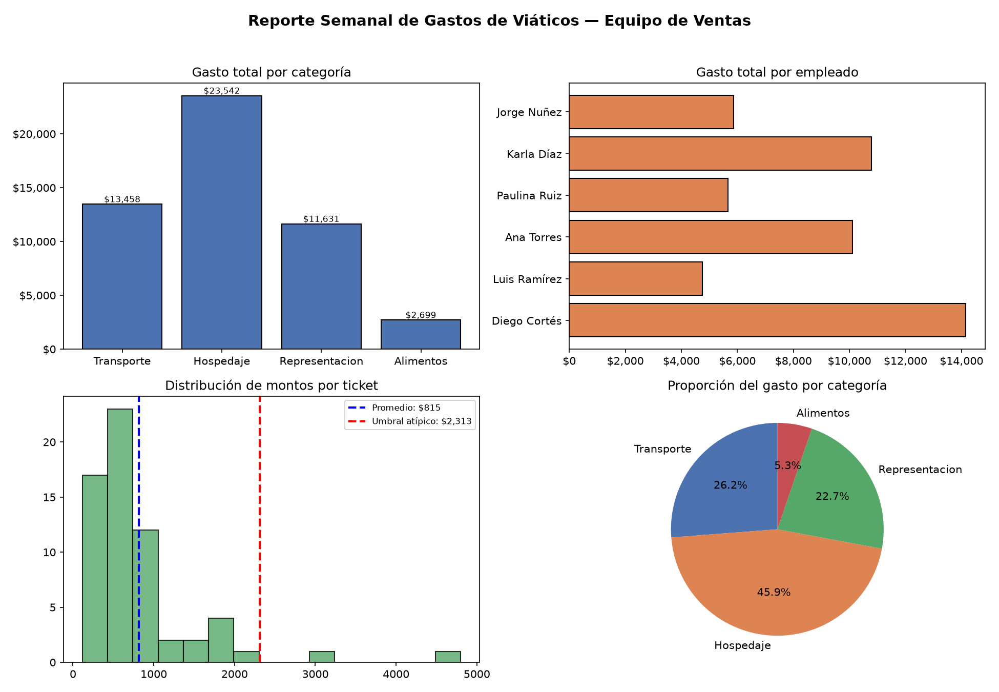

# 📊 Dashboard de Gastos de Viáticos

Automatización de reporte semanal de gastos de viáticos para un equipo de ventas: detecta gastos atípicos con una regla estadística simple y genera un dashboard ejecutivo listo para compartir — sin revisión manual en Excel.

> **Nota:** este proyecto usa datos ficticios generados con fines demostrativos, con el propósito explícito de mostrar el enfoque técnico y de negocio.



## 🧠 El problema que resuelve

Un equipo comercial revisaba manualmente en Excel los gastos de viáticos de su equipo de ventas cada semana, sin visibilidad clara de quién gastaba más, en qué categoría, ni si algún gasto se salía de lo normal.

## ✅ La solución

Un pipeline en Python que:
- Calcula un resumen estadístico ejecutivo (total, promedio, mediana, desviación estándar).
- **Detecta automáticamente gastos atípicos** con una regla estadística (2 desviaciones estándar sobre la media).
- Genera un **dashboard de 4 paneles** (gasto por categoría, por empleado, distribución, proporción).
- Presenta el reporte en terminal con tablas de colores (usando [`rich`](https://github.com/Textualize/rich)).

## 🏗️ Estructura del proyecto

```
gastos_proyecto/
├── config/
│   └── app_config.yaml      # Empleados, categorías, rangos de gasto, umbral
├── src/
│   ├── database.py          # Generación de datos (ficticios, con gastos atípicos inyectados)
│   └── logic.py             # Estadísticas, detección de atípicos, generación del dashboard
├── main.py                  # Orquestador: carga config → genera datos → calcula → reporta
├── requirements.txt
├── Dockerfile
└── dashboard_viaticos.png   # Resultado de ejemplo
```

## 🚀 Instalación y ejecución

### Opción A — entorno virtual local

```bash
# 1. Clonar el repositorio
git clone https://github.com/projectsfreelance344/gastos_proyecto.git
cd gastos_proyecto

# 2. Crear y activar entorno virtual
python -m venv venv
# Windows:
venv\Scripts\activate
# Mac/Linux:
source venv/bin/activate

# 3. Instalar dependencias
pip install -r requirements.txt

# 4. Ejecutar
python main.py
```

### Opción B — Docker

```bash
docker build -t gastos-viaticos .
docker run --rm -v ${PWD}:/app gastos-viaticos
```

## ⚙️ Configuración

Los parámetros del reporte (empleados, categorías, rangos de gasto esperados, umbral de detección de atípicos) se editan en `config/app_config.yaml` — no es necesario tocar el código para ajustar el escenario.

## 🛠️ Tecnologías

`Python` · `matplotlib` · `PyYAML` · `rich` · `Docker`

## 📈 Próximos pasos

- Conexión a una fuente de datos real (CSV/base de datos) en vez de datos simulados.
- Envío automático del reporte por correo.

---

*Proyecto de portafolio — Arcadio Monroy | [LinkedIn](https://www.linkedin.com/in/arcadio-monroy-diaz-73324695) · [Sitio web](https://sites.google.com/view/arcadiomonroydatabi)*